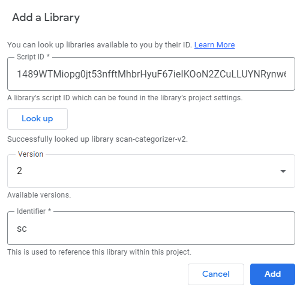

[](https://github.com/google/clasp)

# Scan Categorizer v2 🗃

Script that organizes all PDF files and moves, renames and creates shortcuts dynamically according to predefined categories and file contents. This script can easily be implemented in your current workflows and saves time navigating through Google Drive and enforces directory structures.

Currently, there are two types of conditions that can be applied to each category:

- `or` conditions, which require the document to include one of the words defined.
- `and` conditions, which require the document to include all the words defined.

The conditions can also be chained and multiple conditions of different types can be applied to one category.

```ts
// Don't worry, there is no coding skills required. Just use the UI to generate conditions!
const conditions = [
  {name: 'Lorem', conditions: [and('lorem', 'ipsum')], path: 'Lorem/$y'},
  {name: 'Ipsum', conditions: [or('ipsum', 'dolor')], path: 'Ipsum/$y'},
  {
    name: 'Ipsum',
    conditions: [or('ipsum', 'dolor'), and('lorem', 'ipsum')],
    path: 'Ipsum/$y',
  },
];
```

If you want to match multiple words you can simply use a RegExp. For example, if you want to match all documents that contain the words `Lorem Ipsum`, you can use the following RegExp: `/lorem ipsum/`.

It's important to use a **space between the words**, otherwise the script will not be able to match the words correctly and bare in mind that default JavaScript RegExp are **case sensitive** and must be **lowercase** only.

## Table of contents 📚

- [Scan Categorizer v2 🗃](#scan-categorizer-v2-)
  - [Table of contents 📚](#table-of-contents-)
  - [Getting Started 🚀](#getting-started-)
  - [Installation 👾](#installation-)
    - [Step 1 - Create new Script](#step-1---create-new-script)
    - [Step 2 - Add library](#step-2---add-library)
    - [Step 3 - Configure](#step-3---configure)
  - [Possible use cases 🔥](#possible-use-cases-)
  - [Migrate 🚧](#migrate-)
  - [API ✨](#api-)
    - [Functions](#functions)
  - [Development 🦺](#development-)
  - [Authors 💻](#authors-)
  - [Contributing 🤝](#contributing-)

## Getting Started 🚀

Follow the 7 simple steps in the [Installation](#installation) guide and start configuring your categories. You can even add your code and customize it even more.

## Installation 👾

### Step 1 - Create new Script

Create a new [Google Script](https://script.google.com/) Project within your Google Account. (If App Script is not enabled for your account ask your administrator or switch the account.) When created the project should open an editor.

### Step 2 - Add library

In the sidebar menu, click the plus icon on the left-hand side of Libraries.



- Insert `1489WTMiopg0jt53nfftMhbrHyuF67ieIKOoN2ZCuLLUYNRynw6u6GFS2` as script ID.
- Select your version. (In most cases, choose the latest version.)
- Import the library with the name `sc`.

### Step 3 - Configure

Insert the contents from category UI into your `Code.gs` file.
When running the script you get should asked for permission. Grant the required permissions and test the script.

It's recommended to test your configuration before creating a `Trigger`.

## Possible use cases 🔥

- Finally, go digital by scanning and automatically organizing your old papers.
- Enforce directory structures.
- Automatically distribute incoming mail.
- Create shortcuts for each invoice for your taxes.

## Migrate 🚧

Thanks for using version 1 already, you're awesome! There are several changes in version 2 that will affect your current configurations.

- `$S` argument has been deprecated and can no longer be used.
- There is no more notification email when documents can't get categorized.
- When using custom `rename` functions the `addShortcut` has also been deprecated.
- The `keywords` property has been replaced by `conditions`.

<table>
    <thead>
        <tr>
            <th>v1 Syntax</th>
            <th>v2 Syntax</th>
        </tr>
    </thead>
    <tbody>
<tr>
<td>

```ts
{
  name: "Lorem",
  keywords: ["Lorem", "Ipsum"],
  path: "Lorem/$y/$m",
}
```

</td>
<td>

```ts
{
  name: "Lorem",
  conditions: [or("Lorem", "Ipsum")],
  path: "Lorem/$y/$m",
}
```

</td>
</tr>
<tr>
<td>

```ts
{
  name: "Lorem",
  keywords: ["Lorem", "Ipsum"],
  shortcuts: ["Ipsum/$y"]
  path: "Lorem/$y/$m",
}
```

</td>
<td>

```ts
{
  name: "Lorem",
  conditions: [or("Lorem", "Ipsum")],
  shortcuts: ["Ipsum/$y"] // Still the same
  path: "Lorem/$y/$m",
}
```

</td>
</tr>
</tbody>
</table>

We're sorry if you ran into problems. Please open an Issue if you need help.

## API ✨

### Functions

```ts
sc.categorize(categories: Query.Category[], src: string[]): void
```

### Helper Methods

The library provides several helper methods for better configuration and file management:

#### `isValidPath(path: string): boolean`
Validates a path string for category configuration, ensuring it meets minimum requirements and doesn't contain invalid characters.

#### `isValidPdfFileName(fileName: string): boolean`
Validates a file name to ensure it has a `.pdf` extension.

#### `sanitizeFileName(fileName: string): string`
Sanitizes a file name by removing or replacing invalid characters. Useful when generating file names from user input or document content.

#### `formatDate(date?: Date): string`
Formats a date as `YYYY-MM-DD` string, useful for file naming and path generation.

#### `extractDateFromFileName(fileName: string): Date | null`
Extracts a date from a file name if it contains a date in `YYYY-MM-DD` format.

## Development 🦺

The repository uses Typescript and transpires and pushes the code to the corresponding Google App Script.

Clone the repository and install the dependencies with `yarn install`.
Keep in mind that by default, every function is hidden by using the namespace technique described by clasp docs. To export a function to the users, simply define a wrapper function inside the `index.ts` file (See existing for guidance).

### Code Quality

This project uses several tools to maintain code quality:

- **ESLint** - For code linting and style enforcement
- **Jest** - For unit testing with coverage reporting
- **Husky** - For Git hooks
- **Commitlint** - For enforcing conventional commit messages

### Pre-commit Hooks

The repository uses [Husky](https://typicode.github.io/husky/) to run pre-commit hooks that automatically:
- Run ESLint to check code quality
- Run tests to ensure nothing is broken

These hooks run automatically before each commit to maintain code quality.

### Conventional Commits

This project follows the [Conventional Commits](https://www.conventionalcommits.org/) specification for commit messages. Commit messages must follow this format:

```
<type>(<scope>): <subject>
```

**Types:**
- `feat` - A new feature
- `fix` - A bug fix
- `docs` - Documentation changes
- `style` - Code style changes (formatting, missing semi-colons, etc.)
- `refactor` - Code refactoring
- `perf` - Performance improvements
- `test` - Adding or updating tests
- `build` - Build system changes
- `ci` - CI/CD changes
- `chore` - Other changes that don't modify src or test files
- `revert` - Reverting a previous commit

**Examples:**
```
feat: add new helper method for date extraction
fix: correct sanitization of file names
docs: update README with new helper methods
test: increase coverage for helpers module
```

### Running Tests

```bash
# Run all tests
yarn test

# Run tests with coverage
yarn test --coverage

# Run linter
yarn lint
```

## Authors 💻

- **Michael Beutler** - _Initial work_ - [MichaelBeutler](https://github.com/MichaelBeutler)

## Contributing 🤝

Pull requests are welcome. For major changes, please open an issue first to discuss what you would like to change.

Please make sure to update tests as appropriate and meet the quality gate requirements.
